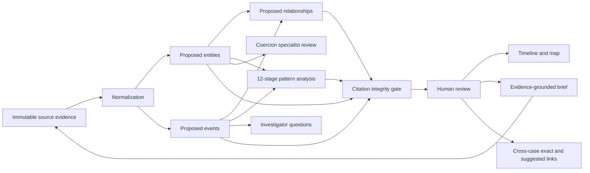

# EvidenceWeaver

-----

## AI-Assisted Development Workflow

EvidenceWeaver was developed through a collaborative workflow using both ChatGPT and OpenAI Codex 5.6, each serving distinct roles throughout the project.

During the early planning stages, ChatGPT was used as a design and architecture partner to help refine the project concept, define the investigative workflow, explore alternative approaches, identify potential challenges, and produce detailed implementation specifications. This planning phase established the product vision, data models, feature priorities, safety considerations, and phased development roadmap before implementation began.

Once the project scope was established, development shifted primarily to Codex 5.6, which served as the principal software engineering tool. Rather than writing code directly, I directed development by describing desired functionality, reviewing completed work, testing features, identifying issues, and iteratively refining the application through continuous feedback.

Because I come from a non-software engineering background, Codex also served as a technical mentor throughout development. In addition to generating code, it was used to explain implementation decisions, clarify unfamiliar concepts, answer questions about APIs and project architecture, and help me understand the installation and execution process. This allowed me to make informed design decisions while steadily improving my understanding of the technologies involved.

Development followed an iterative cycle:

1. Define or refine a feature or workflow.
2. Discuss architectural and implementation options.
3. Direct Codex to implement the selected approach.
4. Test the resulting functionality.
5. Ask questions about implementation details where needed.
6. Refine requirements and repeat.

This workflow allowed me to focus on product design, investigative workflow, usability, and system behavior while leveraging Codex to accelerate implementation and reduce the barrier of traditional programming.

-----

EvidenceWeaver converts messy, unstructured scam-case messages into a human-reviewable investigation workspace. Entities, events, relationships, analytical indicators, and case-brief claims remain traceable to exact excerpts in the original evidence.

The bundled **Operation Glass Harbor** case is entirely fictional and contains 100 synthetic messages. Two additional fictional cases are preloaded with separate evidence and extracted structure: **Operation Paper Comet** has 24 messages, while the superficially unrelated agricultural scenario **Operation Cedar Echo** has 28. Together they demonstrate exact infrastructure links, reused scripts, and behavior-only similarities. No wallet-like identifier, organization, domain, or person in any demonstration is real.

-----

## Judge quick start — no dependency installation

Requirements: Node.js 20.19 or newer. The submission includes the compiled `dist/` client, so judges do not need npm, pnpm, an OpenAI API key, or a dependency installation.

```bash
node scripts/start-demo.mjs
```

Open `http://127.0.0.1:8787`. Stop the server with `Ctrl+C`. See [JUDGES.md](./JUDGES.md) for the short judging path and troubleshooting notes.

The default mock pipeline requires no credentials and exercises the complete workflow for the bundled synthetic case. It is the recommended judge-demo mode. User-created cases require live extraction so the demo fixture can never be mistaken for findings about submitted evidence.

To restore the pristine three-case demonstration, stop the server and run:

```bash
node scripts/reset-demo.mjs --yes
node scripts/start-demo.mjs
```

Reset is recoverable: the prior plaintext demo store and custody ledger are moved into a timestamped `data/backups/` directory. The command refuses to operate in production mode or when encrypted storage is present.

## Developer setup

This repository uses pnpm; do not run `npm install` over an existing pnpm-managed `node_modules` directory.

```bash
pnpm install --frozen-lockfile
pnpm run dev
```

The development client opens at `http://localhost:5173`, with the API on `127.0.0.1:8787`.

-----

## Guided tutorial

Select **Tutorial** in the top bar at any time to start the eleven-step guided walkthrough. The tutorial moves through case organization, evidence preservation, extraction, human review, timeline and relationship analysis, cautious pattern interpretation, cross-case links, investigator questions, the evidence-grounded brief, and custody verification. Each step includes practical usage guidance and highlights the relevant control.

The walkthrough is non-destructive: it navigates between views but never runs extraction, changes a review decision, generates questions or briefs, or modifies case data. Use **Back** and **Next**, the left and right arrow keys, or **Esc** to exit.

-----

## Live OpenAI extraction

Create a project API key in the OpenAI dashboard, then run the masked local setup command:

```bash
pnpm run configure:openai
pnpm run verify:openai
pnpm run dev
```

The server automatically loads the generated Git-ignored `.env`. The setup command does not echo the key. Its resulting settings are equivalent to:

```dotenv
EXTRACTION_MODE=openai
OPENAI_API_KEY=your_server_side_key
OPENAI_MODEL=gpt-5.4-mini
```

The key is read only by the Node server. Never paste it into browser code, commit it, or send it through chat. The live path uses the OpenAI Responses API and strict JSON schemas in six stages: normalization, entity extraction, event extraction, relationship extraction, cautious pattern analysis, and separate coercion-signal review. The model never edits the permanent source text. Invalid or non-verbatim citations reject the proposed output without erasing prior data.

For PowerShell development:

```powershell
$env:EXTRACTION_MODE="openai"
$env:OPENAI_API_KEY="your_server_side_key"
$env:OPENAI_MODEL="gpt-5.4-mini"
pnpm run dev
```

-----

## Security and evidence custody

EvidenceWeaver now has two explicit operating profiles:

- **Demo** is the zero-install, localhost-only judge experience. It uses a clearly identified local administrator, plaintext Git-ignored storage, SHA-256 source fingerprints, and a hash-chained custody ledger.
- **Production** fails closed unless authentication, HTTPS origin, encrypted storage, and custody-record authentication are configured. It accepts identity only from a trusted OpenID Connect (OIDC) access proxy and enforces viewer, analyst, and administrator permissions at the API boundary.

The **Custody record** workspace verifies every source against its intake fingerprint, verifies the append-only ledger, identifies the acting user and action for each recorded mutation, accepts manual custody notes or transfers, and exports a verifiable JSON manifest. In production mode, workspace storage uses AES-256-GCM and every custody record is authenticated with HMAC-SHA-256 in addition to being hash chained.

Production mode is deployment-platform neutral. Generate two separate 32-byte Base64 secrets, store them in the platform's secret manager, and configure the following server-side variables:

```dotenv
APP_MODE=production
AUTH_MODE=external-oidc-proxy
AUTH_PROXY_SECRET=a-separate-random-secret-at-least-32-characters
PUBLIC_ORIGIN=https://evidence.example.org
DATA_ENCRYPTION_KEY=base64-encoded-32-byte-key
DATA_ENCRYPTION_KEY_ID=deployment-key-version
CUSTODY_HMAC_KEY=another-base64-encoded-32-byte-key
HOST=127.0.0.1
```

Generate each cryptographic key independently:

```bash
node -e "console.log(require('node:crypto').randomBytes(32).toString('base64'))"
```

The trusted proxy must remove client-supplied identity headers, authenticate the user, supply `X-EvidenceWeaver-User-Id`, `X-EvidenceWeaver-User-Name`, and `X-EvidenceWeaver-User-Role` (`viewer`, `analyst`, or `admin`), and supply the private proxy secret. TLS terminates at that proxy. Never expose the Node service directly in this configuration.

Enabling encrypted storage does not silently convert an existing plaintext store. Export or migrate it deliberately, then remove the plaintext copy before first production startup. Authentication-provider setup, managed key rotation, database transactions and backups, tenant isolation, retention enforcement, monitoring, and legal certification remain deployment-specific work.

-----

## Demo path

1. Open **Operation Glass Harbor**.
2. Open Evidence to show the 100-message fictional conversation.
3. Run structured extraction.
4. Open Entities and select the long synthetic wallet identifier.
5. Use the right evidence panel to open and highlight the exact source message.
6. Confirm, edit, or reject a proposed finding.
7. Review the chronological progression in Timeline.
8. Select a node or edge in Relationship map.
9. Review all 12 stages, including the explicitly unsupported recovery-scam stage, in Pattern analysis.
10. Open Coercion signals and inspect the direct low-confidence quota language and its benign alternative.
11. Generate prioritized Next questions and mark one answered.
12. Open Linked cases, compare exact and suggested links with Operation Paper Comet and Operation Cedar Echo, then review a link.
13. Generate the Case brief and click a source excerpt to return to evidence.

-----

## Stretch objectives A–D

### A · Scam-pattern intelligence

Pattern analysis always displays the full 12-stage relationship-investment progression. Positive stages cite exact evidence; unsupported stages say **Not observed** and identify the missing context. Summary cards describe relationship-investment, fake-platform, and advance-fee patterns as analytical aids rather than classifications.

### B · Cross-case linking

Linked cases starts with deterministic normalized-value matches and separates them visually from shared-script and event-sequence suggestions. Match IDs are reproducible, review decisions persist, and the comparison view opens either exact source passage. The application never merges cases automatically.

### C · Coercion signals

Possible coercion language is extracted into a dedicated specialist-review model. Every signal includes the speaker, exact excerpt, confidence, priority, related entities, and a benign alternative explanation. The bundled example intentionally uses ambiguous workplace language to demonstrate uncertainty rather than claim trafficking.

### D · Investigator questions

Next questions are generated from non-rejected structured facts. Each record includes priority, why it matters, the evidence that prompted it, information that would answer it, citations, and an answered/dismissed workflow. The generator does not perform or recommend unauthorized access, surveillance, or identity revelation.

-----

## Commands

```bash
pnpm run dev      # API and Vite development server
pnpm run configure:openai # masked local API-key setup
pnpm run verify:openai    # verify key authentication and model access
pnpm test         # source-reference and schema-integrity tests
pnpm run build    # type-check and compile the production client
pnpm start        # serve API and compiled dist/ on 127.0.0.1:8787
pnpm run reset:demo -- --yes # archive demo changes and restore a pristine next launch
pnpm run smoke:demo # test a dependency-free clean copy in an isolated temporary directory
pnpm run check    # tests followed by production build
```

-----

## Architecture



The browser talks only to the Node API. Demo mode persists the workspace in ignored `data/store.json`; configured production mode writes only an authenticated AES-256-GCM container to `data/store.encrypted.json`. All mutations are serialized, source fingerprints are rechecked before analytical changes, and an append-only `data/custody.ndjson` ledger records the actor, purpose, request ID, previous-record hash, and record hash. Mock and live processing share the same data model and integrity gate.

## Project notes

- [Build checklist](./TASKS.md)
- [Architecture decisions](./DECISIONS.md)
- [Limitations and safety](./SAFETY.md)

The judge configuration is deliberately local and text-first. The codebase now demonstrates a platform-neutral production security boundary and formal custody-record foundation, but deployment operations and legal certification are not claimed. OCR, external blockchain queries, identity resolution, and automatic reporting remain outside the prototype scope.
